# Windows-Ubuntu-AD-Integration

Cross-platform integration of an **Ubuntu 24.04 LTS** client with a **Windows Server 2025** Active Directory domain (`cross-os.local`). This project demonstrates my expertise in mixed-environment system administration and enterprise-ready integration.

---

## Overview
I successfully implemented a solution connecting Linux and Windows systems, showcasing the ability to manage complex, cross-platform IT environments. The project demonstrates my skills in:

- Network administration and connectivity troubleshooting  
- Active Directory deployment and management  
- Linux integration with centralized authentication  
- Secure cross-platform authentication with Kerberos  

---

## Technical Skills Demonstrated

**Network Administration**
- Configured static IPs and DNS on Windows Server  
- Tested and resolved cross-platform connectivity issues  

**Active Directory & Domain Services**
- Deployed and promoted Windows Server as a Domain Controller  
- Managed users, computers, and organizational units  
- Established centralized domain management  

**Linux System Integration**
- Configured SSSD and Kerberos on Ubuntu for AD authentication  
- Successfully joined Linux clients to Windows domains  
- Validated domain credentials and ticket-based authentication  

**Security & Authentication**
- Implemented Kerberos ticket-based authentication  
- Verified bi-directional secure communication (SSH and GUI logins)  

---

## Architecture & Implementation

**Environment**
- Windows Server 2025 (DC01) as domain controller  
- Ubuntu 24.04 LTS client (`jays-server`)  
- Domain: `cross-os.local`  

**Network**
- DC: `192.168.99.10` static IP, DNS server role  
- Ubuntu client: DHCP, configured for AD authentication  

---

## Key Achievements

### Phase 1: Windows Server Setup & Domain Creation
- Set up VMs and network environment  
- Configured static IP and DNS  
- Promoted Windows Server to Domain Controller  

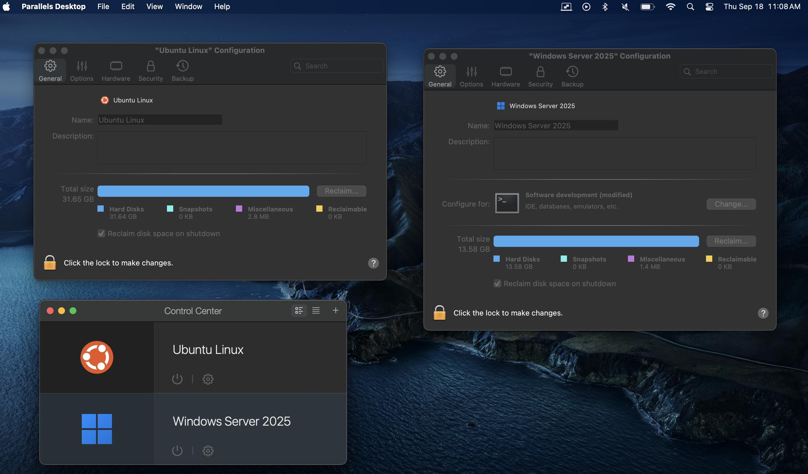  
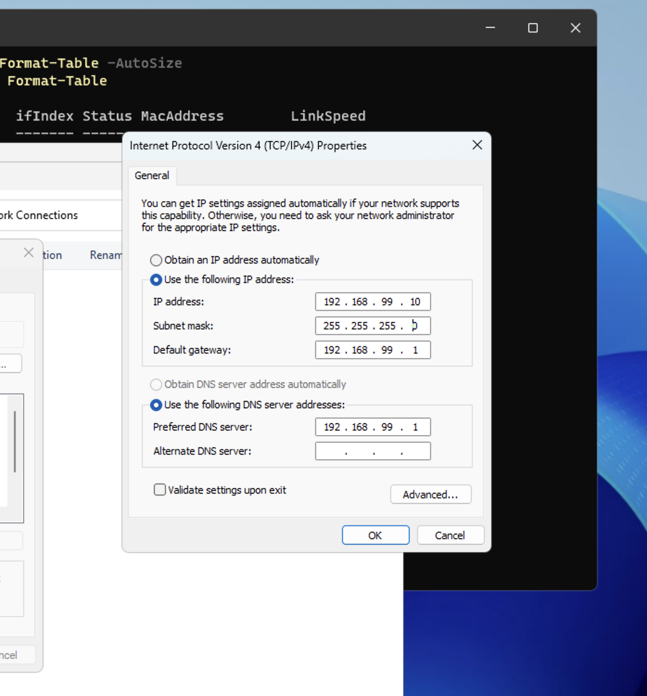  
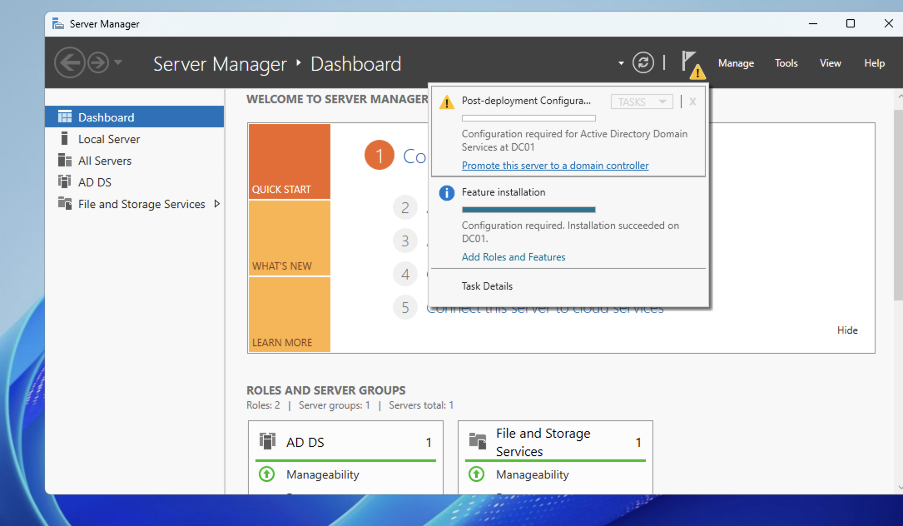  

### Phase 2: Service Validation
- Verified AD and DNS functionality  
- Confirmed network connectivity from Ubuntu client  

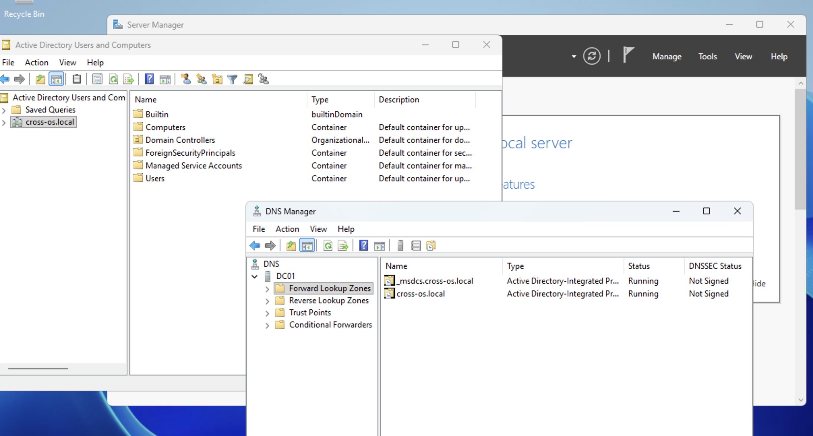  
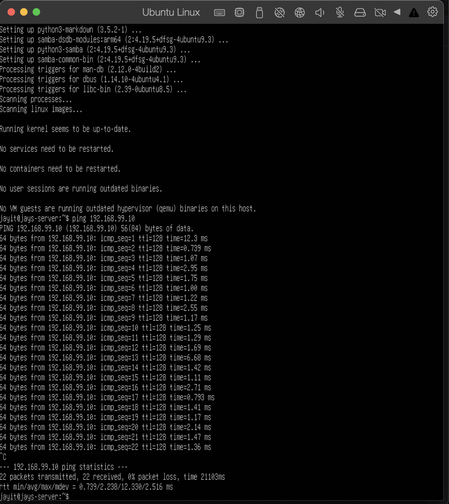  

### Phase 3: Ubuntu Integration
- Installed and configured SSSD, Kerberos, and realm tools  
- Joined Ubuntu client to AD domain successfully  

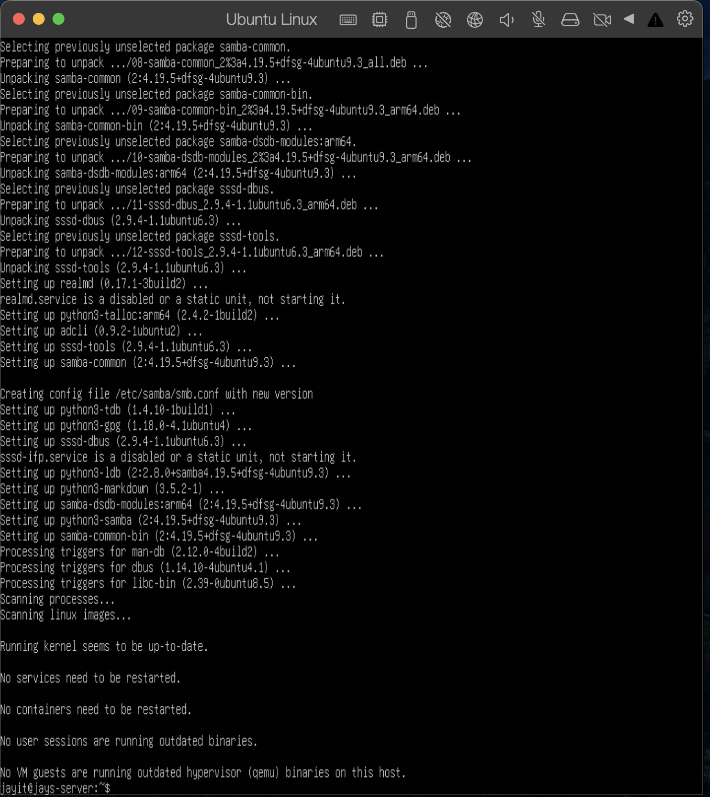  
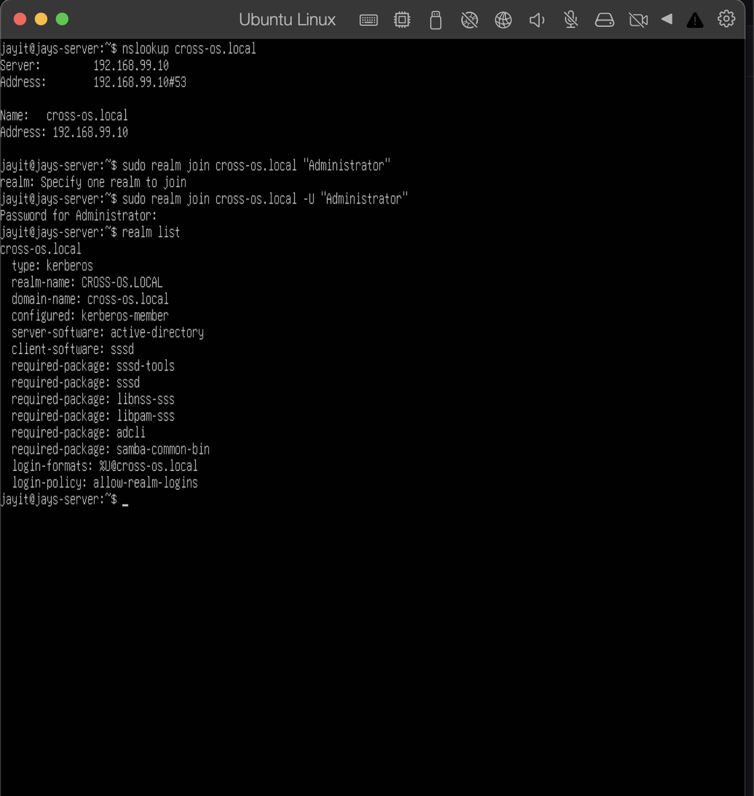  

### Phase 4: Comprehensive Testing
- Created AD user accounts and verified authentication from Ubuntu  
- Validated Kerberos tickets and SSH access  
- Confirmed Ubuntu machine appears in AD console  

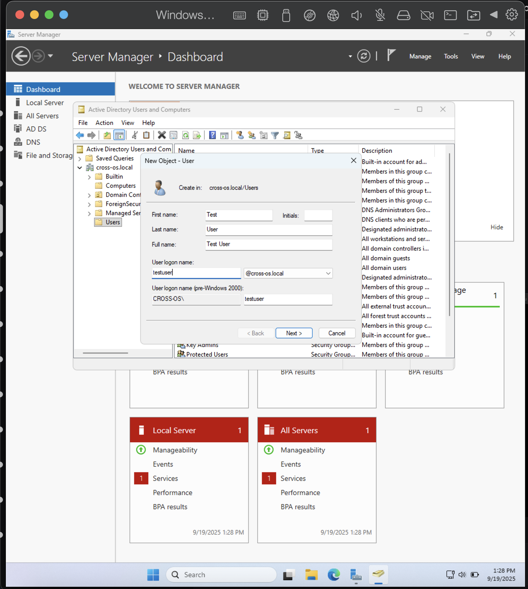  
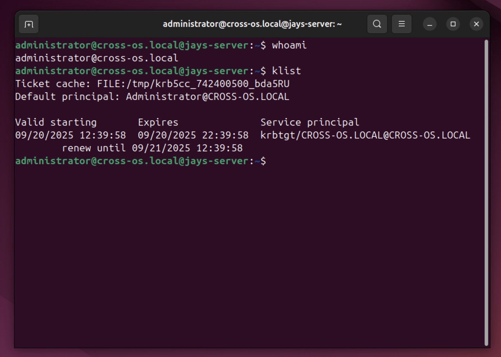  
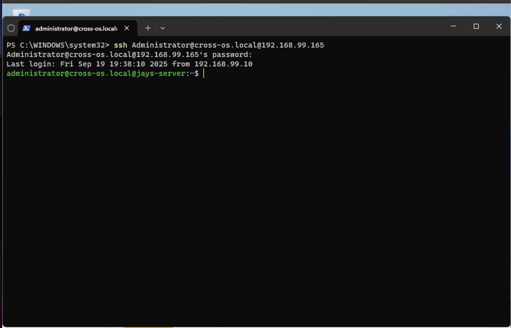  
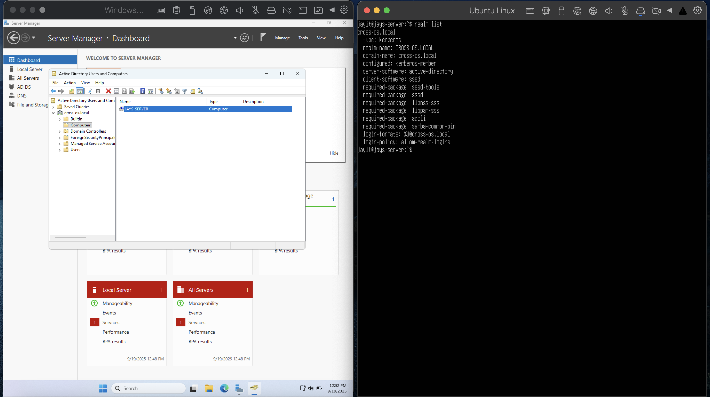  

---

## Results & Impact
- 100% cross-platform authentication success  
- Zero downtime during domain join operations  
- Linux clients fully integrated into Windows-managed infrastructure  
- Bi-directional communication validated (SSH + GUI logins)  

**Professional Value**
- Demonstrates enterprise-ready mixed-environment management  
- Showcases centralized authentication and secure cross-platform integration  
- Highlights problem-solving for real-world IT challenges  

---

## Technologies Used

**Windows Server**
- Active Directory Domain Services (AD DS)  
- DNS Server role  
- PowerShell administration  

**Linux**
- Ubuntu 24.04 LTS  
- SSSD, `realmd`, `adcli`  
- Kerberos authentication  

**Networking & Security**
- Static IP and DNS configuration  
- Secure cross-platform authentication protocols  
